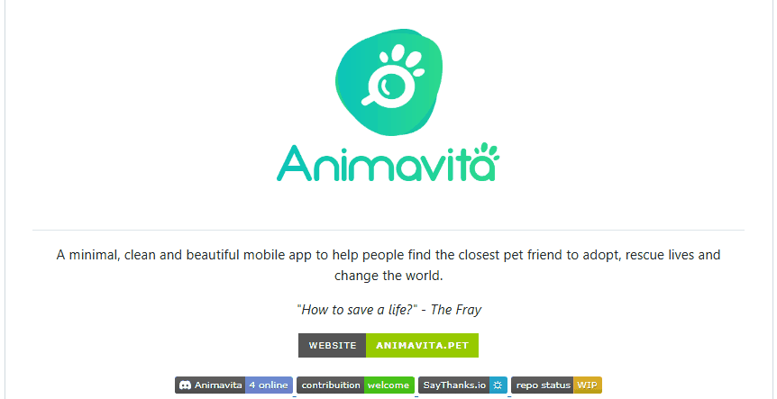

# Projeto com README
Um projeto de teste com arquivo README. 

[](https://google.com)

## Tecnologias utilizadas
- HTML
- CSS
- JS

## Como utilizar
1 - Clone para o projeto
````
git clone <url>
````

2 - Acesse a pasta do projeto
````
cd repositorio-com-readme
````